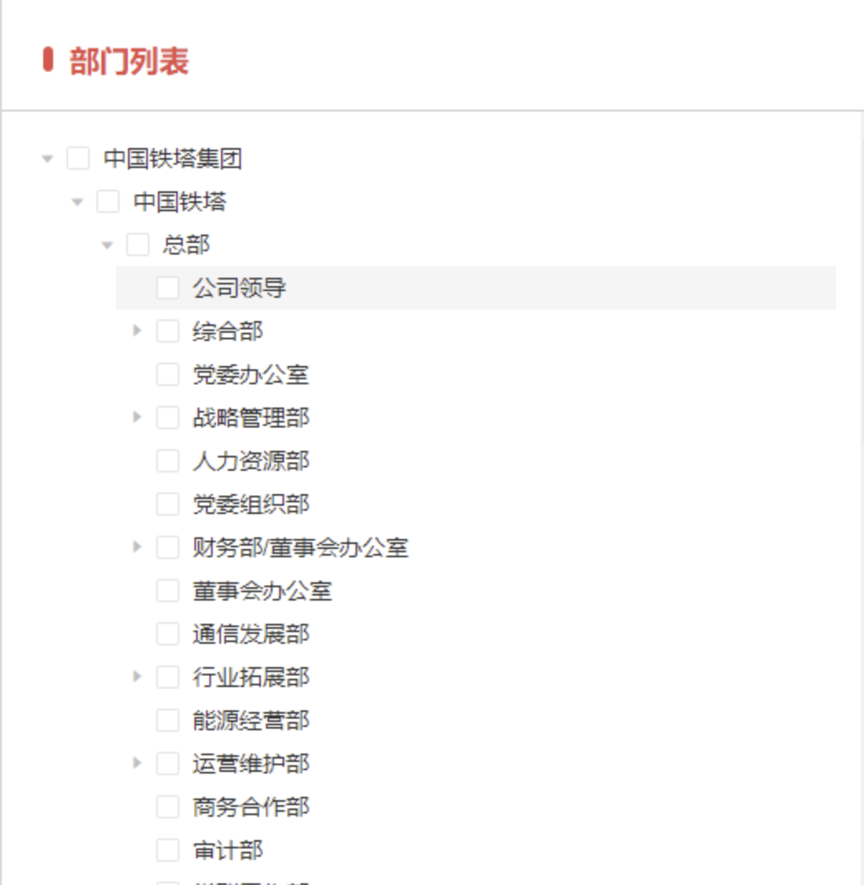

## <!--fit --> 实习生培训——后端开发基础
##### [资料](https://www.aliyundrive.com/s/A1d5WDSfjqg)
##### [课件及源代码](https://github.com/horaoen/howso-backend-training)
##### 联系邮箱：horaoen@gmail.com
---
## 摘要
- [基本开发环境](#基本开发环境)
- [版本控制工具](#版本控制工具) 
- [SQL基础](#sql基础)
- [Maven](#maven)
- [常用技术](#常用技术)
- [基本开发习惯](#基本开发习惯)
- [开发场景演练](#开发场景演练)

---
## 基本开发环境
- [终端](#终端)
- [Docker](#docker)
- [英语学习插件Relingo](#relingo)

---
### 终端

---
#### Windows
1. 微软商店安装windows terminal	

2. [安装新版powershell](https://learn.microsoft.com/zh-cn/powershell/scripting/install/installing-powershell?view=powershell-7.3)

   ```shell
   winget search Microsoft.PowerShell
   winget install --id Microsoft.Powershell --source winget
   ```

3. [安装scoop](https://scoop.sh/#/)

4. 使用scoop安装相关软件
---

   ```
   scoop bucket add java
   scoop install openjdk8-redhat
   scoop install git
   scoop install maven
   scoop install redis
   ```

#### Macos
<style scoped>
  ol {
    font-size: 30px
  }
</style>

1. [安装homebrew](https://brew.sh/index_zh-cn)
2. 安装软件
   ```shell
   brew install iterm2
   brew install zsh
   # 修改默认shell为zsh
   chsh -s /bin/zsh
   ```
3. [oh-my-zsh](https://ohmyz.sh/#install)

---
<style scoped>
  ol {
    font-size: 30px
  }
</style>
### Docker

1. [下载安装](https://www.docker.com/products/docker-desktop/)
2. [官网get-started文档](https://docs.docker.com/get-started/)
3. MySQL、Redis安装
   - [dockerhub](https://hub.docker.com/)
   - [mysql image](https://hub.docker.com/_/mysql)   
   - [redis image](https://hub.docker.com/_/redis)
   
```shell
docker run --name mysql8 -e MYSQL_ROOT_PASSWORD=123456 -p 3306:3306 -d mysql:latest
docker run --name redis -p 6379:6379 -d redis
```
---
### Relingo

---


---

---
## 版本控制工具
- [progit](#progit)
- [常用git命令总结](#常用Git命令总结)
- [IntelliJ IDEA中Git使用](#intellij-idea中git使用)
- vscode中git的使用
---
### progit

---

---

---

---

---

---
### 常用Git命令总结
<style scoped>
  section {
    font-size: 29px
  }
</style>
```shell
git congig --list
git config user.name

git clone <repo url>
git remote -a
git remote -v
git remote add <origin_name> <origin_url>
git remote remove <origin_name>

git checkout <branch_name>
git merge <branch_name>
git rebase <branch_name>

git push <branch_name>
git fetch <branch_name>

git pull <remote_origin_name> (<local_origin_name>) 
# 等效于 git fetch <remote_orgin_name> && git merge <remote_origin_name>
# <local_origin_name>不声明默认为当前操作分支
# eg：有两个分支dev、hotfix，当hotfix想要更新远程dev分支的代码时在hotfix分支执行：
# git pull dev相当于通过fetch更新remote:dev, 再通过merge 将remote:dev合并到local:hotfix上
```

---
### Intellij IDEA中Git使用
1. Local changes中对变更文件管理（rollback、show diff）
2. 代码更新
3. 代码提交
4. 代码合并
5. 解决代码冲突
---
## SQL基础

1. [Getting Started with MySQL Quickly (mysqltutorial.org)](https://www.mysqltutorial.org/getting-started-with-mysql/)
2. [MySQL Basics (mysqltutorial.org)](https://www.mysqltutorial.org/mysql-basics/)

---
## Maven

1. [baeldung maven category](https://www.baeldung.com/category/maven)
2. Maven guide 手册概览
3. IDEA 搜索依赖、maven配置镜像源

---
## 常用技术

1. [SpringBoot](#springboot)
2. [Mybatis Plus](#mybatis-plus)
3. [Hutool](#hutool)

---
### SpringBoot
1. SpringBoot reference guide

### Mybatis Plus
1. 文档概览
2. 条件构造器常见使用
3. 代码生成器

---
### hutool
1. StrUtil
2. JSONUtil
3. TreeUtil
4. RedisDS

---
## 基本开发习惯
1. [常用术语](#常用术语)
2. [开发流程](#开发流程)
3. [接口联调](#接口联调)
3. [代码风格](#代码风格)

---
### 常用术语
1. 拉代码，更新代码，启服务，联调
2. 传参方式(body、parm、path、header)
3. 原型、需求文档、产品
4. 本地环境、开发环境、测试环境、准生产环境
5. 接口文档、swagger、postman、token

---
### 开发流程
1. 开会(需求评估、工作量评估)
2. 开发
   1. 理解原型业务，不确定点同产品商讨 
   2. 前后端独立开发(复杂需求需提前商讨实现方案)
   3. 联调
3. 测试
  - 测试人员测试
  - 开发人员更改

---
### 接口联调
1. swagger、postman的使用
2. 调试

---
### 开发规范
1. 减少hardcode(硬编码)
2. 规避IDE代码审查warning
3. 合理划分git commit颗粒度，编写易懂的commit信息
4. 不写垃圾注释、少保留无用代码
5. copy代码替换为代码封装
6. 编写易读的方法名和变量名可以减少无用注释
---
## 开发场景演练
1. 需求
   - 获取“中国铁塔“以及子部门下的所有部门的目录结构
   - 获取“中国铁塔”以及子部门下的所有部门的目录结构并携带所有叶子结点部门的所属用户
---
2. 原型
   
---
3. 重点
   - 根据开发流程实现基本功能
   - 掌握开发流程中代码版本控制细节
   - 消除警告，合理封装编写可读性可扩展性较好的代码
   - 掌握接口文档编写和接口调试方法